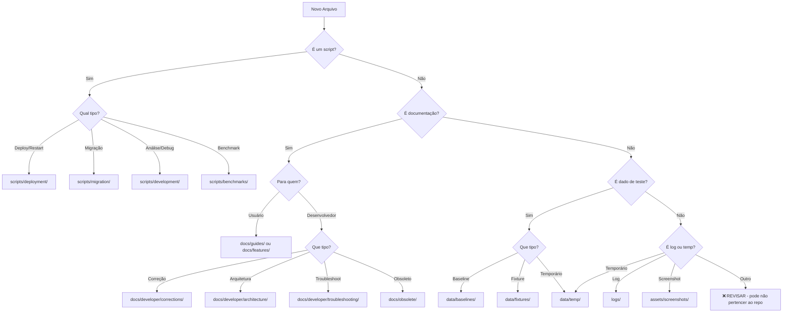

# 🗂️ Guia de Organização do Projeto Skills Eye

**Versão:** 1.0  
**Data:** 2025-11-12  
**Autor:** Sistema de Reorganização Automatizada  

Este documento serve como **GUIA DEFINITIVO** para organizar e manter a estrutura do projeto Skills Eye seguindo **melhores práticas de monorepo profissional**.

---

## 📋 Índice

1. [Princípios de Organização](#-princípios-de-organização)
2. [Estrutura Padrão do Projeto](#-estrutura-padrão-do-projeto)
3. [Categorização de Arquivos](#-categorização-de-arquivos)
4. [Processo de Reorganização](#-processo-de-reorganização)
5. [Regras de .gitignore](#-regras-de-gitignore)
6. [Documentação Obrigatória](#-documentação-obrigatória)
7. [Checklist de Validação](#-checklist-de-validação)
8. [Manutenção Contínua](#-manutenção-contínua)

---

## 🎯 Princípios de Organização

### 1. Raiz Limpa
**REGRA DE OURO:** Máximo 10 arquivos na raiz do projeto

**Arquivos Permitidos na Raiz:**
- ✅ `README.md` - Documentação principal do projeto
- ✅ `CLAUDE.md` - Instruções para IA/Copilot
- ✅ `COMANDOS_RAPIDOS.md` - Quick reference de comandos
- ✅ `DOCUMENTATION_INDEX.md` - Índice de toda documentação
- ✅ `ORGANIZATIONAL_GUIDE.md` - Este arquivo
- ✅ `.gitignore` - Regras de ignore do Git
- ✅ `package.json` / `requirements.txt` - Apenas se projeto raiz
- ✅ `.env.example` - Template de variáveis de ambiente
- ✅ `LICENSE` - Licença do projeto
- ✅ Arquivos de configuração essenciais (.editorconfig, .prettierrc, etc)

**❌ NUNCA na Raiz:**
- Scripts de automação
- Arquivos de log
- Dados de teste
- Arquivos temporários
- Screenshots/imagens
- Documentação específica de features
- Arquivos de correções/patches

### 2. Separação por Finalidade
Cada tipo de arquivo deve estar em sua pasta específica:

| Tipo | Pasta | Gitignored? |
|------|-------|-------------|
| Scripts de deploy | `scripts/deployment/` | ❌ Não |
| Scripts de migração | `scripts/migration/` | ❌ Não |
| Scripts de análise | `scripts/development/` | ❌ Não |
| Scripts de benchmark | `scripts/benchmarks/` | ❌ Não |
| Baselines de teste | `data/baselines/` | ❌ Não |
| Fixtures de teste | `data/fixtures/` | ❌ Não |
| Arquivos temporários | `data/temp/` | ✅ SIM |
| Logs | `logs/` | ✅ SIM |
| Screenshots | `assets/screenshots/` | ❌ Não |
| Docs de features | `docs/features/` | ❌ Não |
| Docs de arquitetura | `docs/developer/architecture/` | ❌ Não |
| Docs de correções | `docs/developer/corrections/` | ❌ Não |
| Docs obsoletos | `docs/obsolete/` | ❌ Não |

### 3. Separação Dev vs User
**Developer-Only Content:**
- Correções aplicadas → `docs/developer/corrections/`
- Análises técnicas → `docs/developer/architecture/`
- Troubleshooting → `docs/developer/troubleshooting/`
- Scripts de debug → `scripts/development/`

**User-Facing Content:**
- Guias de uso → `docs/guides/`
- Documentação de features → `docs/features/`
- FAQ → `docs/user/`

### 4. README em Cada Pasta
**OBRIGATÓRIO:** Toda pasta principal deve ter seu `README.md` explicando:
- Finalidade da pasta
- Estrutura interna
- Como usar os arquivos
- Exemplos práticos
- Guia de manutenção

---

## 🏗️ Estrutura Padrão do Projeto

```
Skills-Eye/
│
├── 📄 README.md                      # Documentação principal (OBRIGATÓRIO)
├── 📄 CLAUDE.md                      # Instruções para IA (OBRIGATÓRIO)
├── 📄 COMANDOS_RAPIDOS.md            # Quick reference
├── 📄 DOCUMENTATION_INDEX.md         # Índice completo
├── 📄 ORGANIZATIONAL_GUIDE.md        # Este guia
├── 📄 .gitignore                     # Git ignore rules
├── 📄 LICENSE                        # Licença do projeto
└── 📄 .env.example                   # Template de env vars
│
├── 📁 backend/                       # API FastAPI + Business Logic
│   ├── api/                          # REST endpoints
│   ├── core/                         # Business logic
│   ├── config/                       # Configurações
│   ├── app.py                        # FastAPI app
│   └── requirements.txt              # Python dependencies
│
├── 📁 frontend/                      # React 19 + TypeScript
│   ├── src/
│   │   ├── pages/                    # Páginas React
│   │   ├── components/               # Componentes reutilizáveis
│   │   ├── contexts/                 # Context API
│   │   ├── hooks/                    # Custom hooks
│   │   ├── services/                 # API clients
│   │   └── types/                    # TypeScript interfaces
│   ├── package.json
│   └── vite.config.ts
│
├── 📁 docs/                          # 📚 DOCUMENTAÇÃO COMPLETA
│   ├── README.md                     # Índice de documentação
│   ├── features/                     # Funcionalidades (user-facing)
│   │   ├── FEATURE_NAME.md
│   │   └── ...
│   ├── guides/                       # Guias de uso (user-facing)
│   │   ├── quick-start.md
│   │   ├── migration.md
│   │   └── ...
│   ├── developer/                    # Para desenvolvedores
│   │   ├── README.md
│   │   ├── architecture/             # Análises técnicas
│   │   │   ├── ANALYSIS_NAME.md
│   │   │   └── ...
│   │   ├── corrections/              # Correções aplicadas
│   │   │   ├── CORRECOES_DATE.md
│   │   │   └── ...
│   │   └── troubleshooting/          # Soluções de problemas
│   │       └── ISSUE_NAME.md
│   ├── planning/                     # Roadmap e refatoração
│   ├── performance/                  # Análises de performance
│   ├── api/                          # API reference
│   ├── obsolete/                     # Documentos antigos
│   └── user/                         # Para usuários finais
│
├── 📁 Tests/                         # 🧪 TESTES AUTOMATIZADOS
│   ├── README.md                     # Guia completo de testes
│   ├── naming/                       # Testes de nomenclatura
│   ├── metadata/                     # Testes de campos dinâmicos
│   ├── performance/                  # Testes de performance
│   └── integration/                  # Testes de integração
│
├── 📁 scripts/                       # 🔧 SCRIPTS DE AUTOMAÇÃO
│   ├── README.md                     # Guia de scripts
│   ├── deployment/                   # Deploy e restart
│   │   ├── restart-all.sh
│   │   ├── restart-backend.sh
│   │   ├── start-app.sh
│   │   └── ...
│   ├── migration/                    # Migrações de dados
│   │   ├── migrate_*.py
│   │   ├── validate_migration.py
│   │   └── ...
│   ├── development/                  # Análise e debug
│   │   ├── analyze_*.py
│   │   ├── compare_*.py
│   │   └── ...
│   └── benchmarks/                   # Performance tests
│       ├── benchmark-*.bat
│       └── run-benchmark-*.ps1
│
├── 📁 data/                          # 📊 DADOS DE TESTE
│   ├── README.md                     # Guia de dados
│   ├── baselines/                    # Baselines JSON
│   │   ├── BASELINE_*.json
│   │   └── ...
│   ├── fixtures/                     # Fixtures de teste
│   │   ├── test_*.json
│   │   └── ...
│   └── temp/                         # Temporários (gitignored)
│       └── temp_*.json
│
├── 📁 logs/                          # 📝 LOGS (gitignored)
│   ├── backend.log
│   ├── migration_report.txt
│   └── ...
│
├── 📁 assets/                        # 🖼️ ASSETS DO PROJETO
│   ├── screenshots/                  # Capturas de tela
│   ├── images/                       # Imagens
│   └── icons/                        # Ícones
│
├── 📁 tools/                         # 🛠️ FERRAMENTAS AUXILIARES
│   └── (scripts utilitários gerais)
│
├── 📁 TenSunS/                       # Legado (embedded repo)
└── 📁 obsolete/                      # Código obsoleto (raiz)
```

---

## 📂 Categorização de Arquivos

### Como Decidir Onde Colocar um Arquivo



### Tabela de Decisão Rápida

| Arquivo | Onde Colocar | Exemplo |
|---------|--------------|---------|
| restart-*.sh, start-*.sh, stop-*.sh | `scripts/deployment/` | `restart-all.sh` |
| migrate_*.py, validate_*.py | `scripts/migration/` | `migrate_consul_kv.py` |
| analyze_*.py, compare_*.py, inspect_*.py | `scripts/development/` | `analyze_profile.py` |
| benchmark-*.bat, run-benchmark-*.ps1 | `scripts/benchmarks/` | `benchmark-api.bat` |
| BASELINE_*.json, *_PRE_*.json | `data/baselines/` | `BASELINE_ENDPOINTS.json` |
| test_*.json (fixtures) | `data/fixtures/` | `test_3servers.json` |
| temp_*.json, cache_*.json | `data/temp/` | `temp_response.json` |
| *.log, *_report.txt | `logs/` | `backend.log` |
| screenshot_*.png, captura_*.jpg | `assets/screenshots/` | `screenshot_dashboard.png` |
| FEATURE_*.md, SISTEMA_*.md | `docs/features/` | `NAMING_SYSTEM_COMPLETE.md` |
| CORRECOES_*.md, FIX_*.md | `docs/developer/corrections/` | `CORRECOES_2025-11-12.md` |
| ANALYSIS_*.md, ARCHITECTURE_*.md | `docs/developer/architecture/` | `METADATA_FIELDS_ANALYSIS.md` |
| quick-start.md, migration.md | `docs/guides/` | `quick-start.md` |
| Docs antigos/desatualizados | `docs/obsolete/` | `OLD_README.md` |

---

## 🔄 Processo de Reorganização

### Passo 1: Análise Inicial

```bash
# 1. Listar TODOS os arquivos na raiz (exceto pastas conhecidas)
cd /path/to/Skills-Eye
ls -1 | grep -v -E '^(backend|frontend|docs|Tests|obsolete|TenSunS|scripts|data|assets|logs|tools)$'

# 2. Contar quantos arquivos precisam ser reorganizados
ls -1 | grep -v -E '^(backend|frontend|docs|Tests|obsolete|TenSunS|scripts|data|assets|logs|tools)$' | wc -l

# 3. Categorizar por tipo
echo "=== SCRIPTS ==="
ls -1 | grep -E '\.(sh|bat|ps1|py)$'

echo "=== DOCUMENTAÇÃO ==="
ls -1 | grep -E '\.md$'

echo "=== DADOS ==="
ls -1 | grep -E '\.(json|csv|xlsx)$'

echo "=== LOGS ==="
ls -1 | grep -E '\.(log|txt)$'

echo "=== IMAGENS ==="
ls -1 | grep -E '\.(png|jpg|jpeg|gif|svg)$'
```

### Passo 2: Criar Estrutura de Pastas

```bash
# Criar TODAS as pastas necessárias de uma vez
mkdir -p scripts/{deployment,migration,development,benchmarks}
mkdir -p data/{baselines,fixtures,temp}
mkdir -p logs
mkdir -p assets/{screenshots,images,icons}
mkdir -p tools
mkdir -p docs/developer/{corrections,architecture,troubleshooting}
mkdir -p docs/{features,guides,planning,performance,api,obsolete,user}
```

### Passo 3: Mover Arquivos Sistematicamente

**3.1. Scripts de Deployment:**
```bash
# Mover scripts de restart, start, stop
mv restart-*.sh restart-*.bat restart-*.ps1 scripts/deployment/
mv start-*.sh start-*.bat start-*.ps1 scripts/deployment/
mv stop-*.sh stop-*.bat stop-*.ps1 scripts/deployment/
```

**3.2. Scripts de Migration:**
```bash
# Mover scripts de migração
mv migrate_*.py scripts/migration/
mv validate_*.py scripts/migration/
```

**3.3. Scripts de Development:**
```bash
# Mover scripts de análise e debug
mv analyze_*.py scripts/development/
mv compare_*.py scripts/development/
mv inspect_*.py scripts/development/
mv test_*.sh scripts/development/
```

**3.4. Scripts de Benchmarks:**
```bash
# Mover scripts de benchmark
mv benchmark-*.bat benchmark-*.ps1 scripts/benchmarks/
mv run-benchmark-*.ps1 scripts/benchmarks/
```

**3.5. Dados de Teste:**
```bash
# Mover baselines
mv BASELINE_*.json data/baselines/
mv *_PRE_*.json data/baselines/
mv TESTE_POS_*.json data/baselines/

# Mover fixtures
mv test_*.json data/fixtures/

# Mover temporários
mv temp_*.json data/temp/
mv cache_*.json data/temp/
```

**3.6. Logs:**
```bash
# Mover logs
mv *.log logs/
mv *_report.txt logs/
mv migration_report.txt logs/
```

**3.7. Assets:**
```bash
# Mover screenshots
mv screenshot_*.png assets/screenshots/
mv captura_*.jpg assets/screenshots/
```

**3.8. Documentação:**
```bash
# Mover correções para docs/developer/corrections/
mv CORRECOES_*.md docs/developer/corrections/
mv FIX_*.md docs/developer/corrections/
mv CHANGELOG-SESSION.md docs/developer/corrections/

# Mover análises para docs/developer/architecture/
mv ANALYSIS_*.md docs/developer/architecture/
mv ARCHITECTURE_*.md docs/developer/architecture/
mv *_INTEGRATION.md docs/developer/architecture/

# Mover features para docs/features/
mv FEATURE_*.md docs/features/
mv SISTEMA_*.md docs/features/
mv *_COMPLETE.md docs/features/

# Mover obsoletos para docs/obsolete/
# (Verificar manualmente quais docs estão desatualizados)
mv OLD_*.md docs/obsolete/
```

### Passo 4: Atualizar .gitignore

```bash
# Adicionar ao .gitignore
cat >> .gitignore << 'EOF'

# Logs (entire logs/ directory)
logs/
*.log

# Temporary data files
data/temp/
temp_*.json
cache_*.json

EOF
```

### Passo 5: Criar READMEs

**scripts/README.md:**
```markdown
# Scripts - Skills Eye

## Estrutura
- deployment/ - Scripts de deploy e restart
- migration/ - Scripts de migração de dados
- development/ - Scripts de análise e debug
- benchmarks/ - Scripts de performance tests

## Uso
Ver exemplos em cada subpasta.
```

**data/README.md:**
```markdown
# Data - Dados de Teste

## Estrutura
- baselines/ - Baselines JSON para comparação
- fixtures/ - Fixtures de teste reutilizáveis
- temp/ - Temporários (gitignored)

## Uso
Ver exemplos de uso em Tests/README.md
```

### Passo 6: Atualizar Documentação Principal

**README.md:**
- Adicionar seção "Estrutura do Projeto"
- Adicionar navegação por perfil (User/Dev/QA/DevOps)
- Atualizar caminhos de arquivos

**DOCUMENTATION_INDEX.md:**
- Atualizar índice com nova estrutura
- Adicionar links para novas pastas
- Documentar arquivos movidos

### Passo 7: Validação

```bash
# 1. Verificar que raiz está limpa (máximo 10 arquivos)
ls -1 | grep -v -E '^(backend|frontend|docs|Tests|obsolete|TenSunS|scripts|data|assets|logs|tools)$' | wc -l
# Resultado esperado: ≤ 10

# 2. Verificar que pastas foram criadas
ls -d scripts/*/ data/*/ docs/developer/*/

# 3. Contar arquivos movidos
echo "Scripts: $(find scripts/ -type f | wc -l)"
echo "Data: $(find data/ -type f | wc -l)"
echo "Docs Developer: $(find docs/developer/ -name '*.md' | wc -l)"

# 4. Verificar .gitignore
grep -E 'logs/|data/temp/|temp_\*.json' .gitignore
```

### Passo 8: Commit e Push

```bash
# 1. Add all changes
git add -A

# 2. Commit com mensagem detalhada
git commit -m "feat: Reorganização Completa do Projeto

🎯 OBJETIVO: Organizar [X]+ arquivos seguindo melhores práticas

📂 ESTRUTURA CRIADA:
- scripts/ ([X] scripts em 4 categorias)
- data/ ([X] arquivos)
- docs/developer/ ([X] docs)
- logs/ (gitignored)

📝 DOCUMENTAÇÃO ATUALIZADA:
- README.md
- DOCUMENTATION_INDEX.md
- .gitignore
- scripts/README.md (novo)
- data/README.md (novo)

📊 RESULTADO:
- ANTES: [X]+ arquivos na raiz
- DEPOIS: [X] arquivos essenciais na raiz

🎯 BENEFÍCIOS:
- Raiz limpa e profissional
- Navegação clara
- Scripts categorizados
- Dados de teste isolados
"

# 3. Push para GitHub
git push origin main

# 4. Verificar no GitHub
# Confirmar que estrutura está correta
```

---

## 🚫 Regras de .gitignore

### Conteúdo Obrigatório

```gitignore
# Python
__pycache__/
*.py[cod]
*$py.class
*.so
.Python
build/
dist/
*.egg-info/

# FastAPI / Uvicorn
.env
.env.local
.env.production

# Node.js / npm
node_modules/
npm-debug.log*
.pnpm-debug.log*

# Frontend build
frontend/dist/
frontend/build/

# IDE
.vscode/
.idea/
*.swp
*.swo

# OS
.DS_Store
Thumbs.db

# ============================================
# REORGANIZAÇÃO - ADICIONAR ESTAS LINHAS
# ============================================

# Logs (entire logs/ directory)
logs/
*.log

# Temporary data files
data/temp/
temp_*.json
cache_*.json

# Runtime data
pids
*.pid
*.seed
*.pid.lock

# Coverage
coverage/
*.lcov

# Optional caches
.npm
.eslintcache

# dotenv
.env
.env.test
.env.local

# Project specific
backend/.env
nul

# Embedded repositories
TenSunS/

# Claude settings
.claude/settings.local.json
```

### O que NUNCA Ignorar

- ❌ `scripts/` - Scripts são parte do código
- ❌ `data/baselines/` - Baselines são referência
- ❌ `data/fixtures/` - Fixtures são parte dos testes
- ❌ `docs/` - Documentação é crítica
- ❌ `assets/` - Assets fazem parte do projeto

### O que SEMPRE Ignorar

- ✅ `logs/` - Logs são gerados localmente
- ✅ `data/temp/` - Temporários são regenerados
- ✅ `*.log` - Logs individuais
- ✅ `temp_*.json` - Arquivos temporários
- ✅ `cache_*.json` - Cache local

---

## 📚 Documentação Obrigatória

### 1. README.md (Raiz)

**Seções Obrigatórias:**
```markdown
# Nome do Projeto

## Sobre o Projeto
## Stack Tecnológico
## Instalação
## Funcionalidades
## Estrutura do Projeto ← OBRIGATÓRIO
## API Reference
## Documentação
## Roadmap
## Contribuindo
## Licença
```

**Seção "Estrutura do Projeto":**
- Árvore visual completa
- Descrição de cada pasta principal
- Tabela de organização por tipo
- Navegação rápida por perfil
- Como encontrar algo no projeto

### 2. DOCUMENTATION_INDEX.md (Raiz)

**Conteúdo:**
- Índice completo de TODA documentação
- Organizado por categoria
- Links para todos os documentos
- Última atualização
- Navegação rápida

### 3. scripts/README.md

**Conteúdo:**
- Estrutura de subpastas
- Tabela de scripts com descrição
- Exemplos de uso
- Quando usar cada script
- Guia de manutenção

### 4. data/README.md

**Conteúdo:**
- Estrutura de subpastas
- Finalidade de cada tipo de dado
- Formato dos arquivos
- Como usar em testes
- Quando criar nova baseline

### 5. docs/developer/README.md

**Conteúdo:**
- Estrutura para desenvolvedores
- architecture/ - o que contém
- corrections/ - o que contém
- troubleshooting/ - o que contém
- Como navegar

### 6. Tests/README.md (já existe)

**Manter atualizado com:**
- Estrutura de testes
- Como executar
- Como adicionar novos testes

---

## ✅ Checklist de Validação

### Antes de Commitar

```markdown
## Estrutura
- [ ] Raiz tem no máximo 10 arquivos
- [ ] Pastas criadas: scripts/, data/, logs/, assets/, docs/developer/
- [ ] Subpastas: scripts/{deployment,migration,development,benchmarks}
- [ ] Subpastas: data/{baselines,fixtures,temp}
- [ ] Subpastas: docs/developer/{architecture,corrections,troubleshooting}

## Arquivos Movidos
- [ ] Scripts de deployment em scripts/deployment/
- [ ] Scripts de migration em scripts/migration/
- [ ] Scripts de development em scripts/development/
- [ ] Scripts de benchmarks em scripts/benchmarks/
- [ ] Baselines em data/baselines/
- [ ] Fixtures em data/fixtures/
- [ ] Temporários em data/temp/
- [ ] Logs em logs/
- [ ] Screenshots em assets/screenshots/
- [ ] Correções em docs/developer/corrections/
- [ ] Arquitetura em docs/developer/architecture/
- [ ] Obsoletos em docs/obsolete/

## .gitignore
- [ ] logs/ adicionado
- [ ] data/temp/ adicionado
- [ ] temp_*.json adicionado
- [ ] cache_*.json adicionado (se aplicável)

## Documentação
- [ ] README.md tem seção "Estrutura do Projeto"
- [ ] README.md tem navegação por perfil
- [ ] DOCUMENTATION_INDEX.md atualizado
- [ ] scripts/README.md criado e completo
- [ ] data/README.md criado e completo
- [ ] docs/developer/README.md criado (se novo)

## Validação Técnica
- [ ] Contagem de arquivos na raiz: ≤ 10
- [ ] Scripts funcionam nos novos caminhos
- [ ] Links internos em docs atualizados
- [ ] Nenhum arquivo crítico foi deletado acidentalmente

## Git
- [ ] git status verificado
- [ ] Todas mudanças em staging
- [ ] Commit message descritiva e completa
- [ ] Push para GitHub realizado
- [ ] Estrutura verificada no GitHub
```

### Comandos de Validação

```bash
# 1. Contar arquivos na raiz
cd /path/to/project
RAIZ=$(ls -1 | grep -v -E '^(backend|frontend|docs|Tests|obsolete|TenSunS|scripts|data|assets|logs|tools)$' | wc -l)
echo "Arquivos na raiz: $RAIZ (máximo: 10)"
if [ $RAIZ -le 10 ]; then echo "✅ OK"; else echo "❌ ERRO: Muitos arquivos na raiz"; fi

# 2. Verificar pastas criadas
for dir in scripts/deployment scripts/migration scripts/development scripts/benchmarks \
           data/baselines data/fixtures data/temp \
           docs/developer/architecture docs/developer/corrections logs assets/screenshots; do
    if [ -d "$dir" ]; then
        echo "✅ $dir existe"
    else
        echo "❌ $dir NÃO existe"
    fi
done

# 3. Contar arquivos organizados
echo "Scripts: $(find scripts/ -type f 2>/dev/null | wc -l)"
echo "Data: $(find data/ -type f 2>/dev/null | wc -l)"
echo "Docs Developer: $(find docs/developer/ -name '*.md' 2>/dev/null | wc -l)"

# 4. Verificar .gitignore
echo "=== Verificando .gitignore ==="
grep -q 'logs/' .gitignore && echo "✅ logs/" || echo "❌ logs/ FALTANDO"
grep -q 'data/temp/' .gitignore && echo "✅ data/temp/" || echo "❌ data/temp/ FALTANDO"
grep -q 'temp_\*.json' .gitignore && echo "✅ temp_*.json" || echo "❌ temp_*.json FALTANDO"

# 5. Verificar READMEs obrigatórios
for readme in README.md DOCUMENTATION_INDEX.md scripts/README.md data/README.md; do
    if [ -f "$readme" ]; then
        echo "✅ $readme existe"
    else
        echo "❌ $readme NÃO existe"
    fi
done
```

---

## 🔧 Manutenção Contínua

### Quando Adicionar Novo Arquivo

**1. Questione-se:**
- Este arquivo pertence ao repositório?
- Ele será usado por outros desenvolvedores?
- Ele contém dados sensíveis?
- Ele pode ser regenerado?

**2. Categorize:**
- Use a [Tabela de Decisão Rápida](#tabela-de-decisão-rápida)
- Siga o [Fluxograma de Categorização](#como-decidir-onde-colocar-um-arquivo)

**3. Documente:**
- Adicione ao README da pasta apropriada
- Se for um script, documente no scripts/README.md
- Se for uma fixture, documente no data/README.md

**4. Valide:**
- Execute o checklist de validação
- Verifique que raiz continua limpa

### Limpeza Regular

**Semanal:**
```bash
# Limpar arquivos temporários
rm -rf data/temp/*

# Limpar logs antigos (mais de 7 dias)
find logs/ -name "*.log" -mtime +7 -delete
```

**Mensal:**
```bash
# Verificar obsoletos
# Mover docs desatualizados para docs/obsolete/

# Verificar baselines antigas
# Arquivar baselines antigas (mais de 6 meses)
find data/baselines/ -name "*.json" -mtime +180 -exec mv {} data/baselines/archive/ \;
```

**Trimestral:**
```bash
# Revisar estrutura completa
# Executar checklist de validação
# Atualizar documentação
# Verificar se novos padrões surgiram
```

### Quando Refatorar

**Sinais de que precisa reorganizar:**
- ❌ Mais de 10 arquivos na raiz
- ❌ Scripts espalhados em múltiplas pastas
- ❌ Documentação difícil de encontrar
- ❌ Novos desenvolvedores se perdem
- ❌ Arquivos com nomes genéricos (temp1.json, test.py)
- ❌ Pastas sem README

**Ação:**
1. Execute este guia completo
2. Valide com checklist
3. Commit e push
4. Atualize documentação

---

## 🚀 Automatização (Futuro)

### Script de Reorganização Automática

```bash
#!/bin/bash
# reorganize.sh - Script de reorganização automática

# TODO: Implementar script que:
# 1. Analisa arquivos na raiz
# 2. Categoriza automaticamente
# 3. Move para pastas apropriadas
# 4. Atualiza .gitignore
# 5. Gera relatório
# 6. Valida resultado

echo "🚧 Em desenvolvimento..."
```

### Hooks do Git

```bash
# .git/hooks/pre-commit
# Validar que raiz não tem muitos arquivos

#!/bin/bash
RAIZ=$(git ls-files | grep -v -E '^(backend|frontend|docs|Tests|obsolete|TenSunS|scripts|data|assets|logs|tools)/' | wc -l)

if [ $RAIZ -gt 10 ]; then
    echo "❌ ERRO: Muitos arquivos na raiz ($RAIZ)"
    echo "Execute reorganização antes de commitar"
    exit 1
fi

echo "✅ Estrutura OK"
exit 0
```

---

## 📞 Suporte

**Dúvidas sobre organização:**
1. Consulte este guia
2. Verifique DOCUMENTATION_INDEX.md
3. Veja exemplos em outros projetos da organização

**Problemas após reorganização:**
1. Verifique se scripts funcionam nos novos caminhos
2. Atualize imports/paths no código
3. Execute testes para validar

**Sugestões de melhorias:**
- Abra issue no GitHub
- Proponha mudanças neste guia
- Documente novos padrões encontrados

---

## 📜 Histórico de Versões

| Versão | Data | Mudanças |
|--------|------|----------|
| 1.0 | 2025-11-12 | Versão inicial - Reorganização completa de 51+ arquivos |

---

## 📚 Referências

- [Write the Docs - Documentation as Code](https://www.writethedocs.org/guide/docs-as-code/)
- [Best Practices for Monorepo Structure](https://monorepo.tools/)
- [Git Best Practices](https://git-scm.com/book/en/v2/Distributed-Git-Contributing-to-a-Project)
- [README Best Practices](https://github.com/jehna/readme-best-practices)

---

**✨ Mantenha o projeto organizado para facilitar colaboração e manutenção!**
