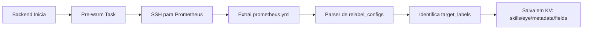
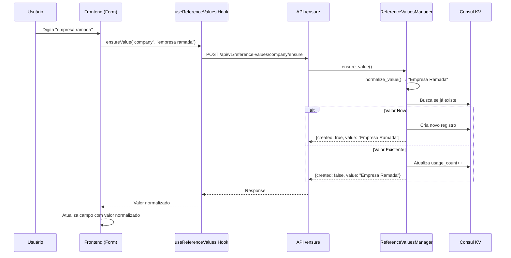

# 📚 REFERENCE VALUES - GUIA COMPLETO DO SISTEMA

**Versão:** 2.0
**Última Atualização:** 2025-11-11
**Autor:** Sistema Skills Eye
**Status:** ✅ Produção

---

## 📑 ÍNDICE

1. [Visão Geral](#visão-geral)
2. [Arquitetura do Sistema](#arquitetura-do-sistema)
3. [Fluxo de Dados](#fluxo-de-dados)
4. [Funcionalidades Principais](#funcionalidades-principais)
5. [Páginas e Dependências](#páginas-e-dependências)
6. [Sistema de Categorias](#sistema-de-categorias)
7. [Auto-Cadastro Dinâmico](#auto-cadastro-dinâmico)
8. [Persistência e KV Storage](#persistência-e-kv-storage)
9. [Bulk Update de Serviços](#bulk-update-de-serviços)
10. [APIs e Endpoints](#apis-e-endpoints)
11. [Frontend - Componentes](#frontend---componentes)
12. [Casos de Uso](#casos-de-uso)
13. [Troubleshooting](#troubleshooting)
14. [Roadmap e Melhorias](#roadmap-e-melhorias)

---

## 🎯 VISÃO GERAL

### O que é Reference Values?

Reference Values é um **sistema de gerenciamento de valores de referência** para campos metadata dos serviços Consul. Funciona como um "banco de dados normalizado" de valores válidos que podem ser usados em cadastros.

### Para que serve?

1. **Normalização de dados** - Evita duplicatas ("Empresa Ramada" vs "empresa ramada")
2. **Auto-cadastro** - Cria valores automaticamente quando novos aparecem
3. **Padronização** - Garante consistência em campos como empresa, cidade, localização
4. **Auditoria** - Rastreia quando valores foram criados, por quem, e quantas vezes são usados
5. **Propagação de mudanças** - Quando você renomeia um valor, TODOS os serviços são atualizados

### Exemplo Prático

```
Sem Reference Values:
  Serviço 1: company = "Empresa Ramada"
  Serviço 2: company = "empresa ramada"
  Serviço 3: company = "EMPRESA RAMADA"
  → 3 valores diferentes, relatórios fragmentados ❌

Com Reference Values:
  Todos normalizam para: company = "Empresa Ramada"
  → 1 valor único, relatórios precisos ✅
```

---

## 🏗️ ARQUITETURA DO SISTEMA

### Stack Tecnológico

**Backend:**
- Python 3.12 + FastAPI
- AsyncIO (operações assíncronas)
- Consul KV (storage persistente)
- Pydantic (validação)

**Frontend:**
- React 19 + TypeScript
- Ant Design Pro (ProTable)
- Custom Hook: `useReferenceValues`
- Cache global (5 minutos)

### Estrutura de Diretórios

```
backend/
├── api/
│   └── reference_values.py          # 580 linhas - API REST endpoints
├── core/
│   ├── reference_values_manager.py  # 862 linhas - Lógica de negócio
│   └── category_manager.py          # 249 linhas - Gerenciamento de categorias
└── config/
    └── metadata_fields.json          # Campos habilitados (KV)

frontend/
├── src/
│   ├── pages/
│   │   └── ReferenceValues.tsx      # 727 linhas - Página principal
│   └── hooks/
│       └── useReferenceValues.ts    # 478 linhas - Hook customizado
```

---

## 🔄 FLUXO DE DADOS

### 1. Extração de Campos (Backend Startup)



**Arquivo:** `backend/app.py` (linhas 55-204)

**O que acontece:**
1. Backend se conecta via SSH aos servidores Prometheus
2. Baixa os arquivos `prometheus.yml`
3. Analisa os `relabel_configs` para encontrar campos metadata
4. Extrai os `target_label` (ex: `company`, `localizacao`, `cidade`)
5. **MERGE INTELIGENTE**: Preserva customizações do usuário
6. Salva no KV do Consul

### 2. Habilitação de Campos

**Campos Preservados (14 campos):**
```python
user_customization_fields = [
    'available_for_registration',  # ← Se aparece em Reference Values
    'display_name',                # Nome amigável
    'field_type',                  # string, select, number
    'category',                    # basic, infrastructure, extra, etc
    'description',
    'order',
    'required',
    'editable',
    'show_in_table',
    'show_in_dashboard',
    'show_in_form',
    'show_in_services',
    'show_in_exporters',
    'show_in_blackbox',
]
```

**Campos Técnicos (atualizados do Prometheus):**
- `name` - Identificador único
- `source_label` - Label do Consul
- `options` - Valores únicos existentes
- `sync_status` - Estado de sincronização

### 3. Auto-Cadastro (Fluxo Completo)



**Código Backend:** `backend/core/reference_values_manager.py:87-172`

**Normalização:**
```python
def normalize_value(self, value: str) -> str:
    """
    Normaliza valor:
    - Remove espaços extras
    - Capitaliza primeira letra de cada palavra
    - Preserva acentos e caracteres especiais
    """
    return ' '.join(word.capitalize() for word in value.split())
```

**Exemplo:**
```
Input:  "  empresa   RAMADA  "
Output: "Empresa Ramada"
```

### 4. Storage no Consul KV

**Estrutura:**
```
skills/eye/
├── metadata/
│   ├── fields.json                    # Configuração de campos (CRÍTICO)
│   └── categories.json                # Categorias disponíveis
└── reference_values/
    ├── company.json                   # Lista de empresas
    ├── localizacao.json               # Lista de localizações
    ├── cidade.json                    # Lista de cidades
    └── vendor.json                    # Lista de fornecedores
```

**Exemplo de Valor:**
```json
{
  "value": "Empresa Ramada",
  "created_at": "2025-11-11T10:30:00Z",
  "created_by": "adriano",
  "updated_at": "2025-11-11T12:45:00Z",
  "updated_by": "adriano",
  "usage_count": 15,
  "last_used_at": "2025-11-11T14:20:00Z",
  "metadata": {
    "cnpj": "12.345.678/0001-90",
    "contrato": "2024-001"
  },
  "change_history": [
    {
      "timestamp": "2025-11-11T12:45:00Z",
      "user": "adriano",
      "action": "rename",
      "old_value": "Ramada Empresa",
      "new_value": "Empresa Ramada"
    }
  ]
}
```

---

## ⚙️ FUNCIONALIDADES PRINCIPAIS

### 1. Listar Valores

**Endpoint:** `GET /api/v1/reference-values/{field_name}`

**Parâmetros:**
- `include_stats` (bool) - Incluir usage_count e last_used_at

**Response:**
```json
{
  "success": true,
  "total": 25,
  "values": [
    {
      "value": "Empresa Ramada",
      "created_at": "2025-11-11T10:30:00Z",
      "created_by": "adriano",
      "usage_count": 15,
      "last_used_at": "2025-11-11T14:20:00Z",
      "metadata": {}
    }
  ]
}
```

### 2. Criar Valor (Manual)

**Endpoint:** `POST /api/v1/reference-values/{field_name}`

**Request:**
```json
{
  "value": "Nova Empresa",
  "metadata": {
    "cnpj": "98.765.432/0001-10"
  }
}
```

**Uso:** Quando você quer cadastrar valores ANTES de usá-los nos serviços.

### 3. Auto-Cadastro (Ensure)

**Endpoint:** `POST /api/v1/reference-values/{field_name}/ensure`

**Request:**
```json
{
  "value": "empresa teste",
  "metadata": {}
}
```

**Response:**
```json
{
  "success": true,
  "created": true,
  "value": "Empresa Teste",
  "message": "Valor criado com sucesso"
}
```

**Uso:** Chamado automaticamente por formulários de cadastro.

### 4. Renomear Valor (BULK UPDATE)

**Endpoint:** `PATCH /api/v1/reference-values/{field_name}/{old_value}/rename?new_value={new_value}`

**O que faz:**
1. Renomeia valor no Reference Values
2. **Busca TODOS os serviços** no Consul que usam esse valor
3. **Atualiza metadata de cada serviço** com novo valor
4. Mantém histórico de mudança
5. Retorna quantos serviços foram atualizados

**Exemplo:**
```bash
PATCH /api/v1/reference-values/company/Emin/rename?new_value=EMIN%20Empresa

Response:
{
  "success": true,
  "message": "Valor renomeado de 'Emin' para 'EMIN Empresa'. 12 serviços atualizados."
}
```

**Código:** `backend/core/reference_values_manager.py:375-496`

**Fluxo do Bulk Update:**
```python
async def _bulk_update_services(
    self,
    field_name: str,
    old_value: str,
    new_value: str
) -> Tuple[int, int]:
    """
    Atualiza TODOS os serviços que usam um valor.

    Returns:
        (services_updated, services_failed)
    """
    # 1. Buscar TODOS os serviços no Consul
    services = await self.consul.get_services()

    # 2. Filtrar serviços que usam o valor antigo
    to_update = []
    for svc_id, service in services.items():
        meta = service.get('Meta', {})
        if meta.get(field_name) == old_value:
            to_update.append((svc_id, service))

    # 3. Atualizar cada serviço (async parallel)
    tasks = []
    for svc_id, service in to_update:
        task = self._update_single_service(
            svc_id, service, field_name, new_value
        )
        tasks.append(task)

    results = await asyncio.gather(*tasks, return_exceptions=True)

    # 4. Contar sucessos e falhas
    updated = sum(1 for r in results if r is True)
    failed = len(results) - updated

    return updated, failed
```

### 5. Deletar Valor

**Endpoint:** `DELETE /api/v1/reference-values/{field_name}/{value}?force=false`

**Proteção:**
- Se `force=false` e valor está em uso → **BLOQUEIA**
- Se `force=true` → Deleta mesmo se em uso

**Response (bloqueado):**
```json
{
  "success": false,
  "error": "Valor 'Empresa Ramada' está em uso em 15 instância(s). Não é possível deletar."
}
```

### 6. Atualizar Metadata

**Endpoint:** `PUT /api/v1/reference-values/{field_name}/{value}`

**Request:**
```json
{
  "metadata": {
    "cnpj": "12.345.678/0001-90",
    "contrato": "2024-001",
    "responsavel": "João Silva"
  }
}
```

**Uso:** Adicionar informações extras ao valor (CNPJ, contrato, etc).

---

## 📄 PÁGINAS E DEPENDÊNCIAS

### Páginas que USAM Reference Values

#### 1. **Reference Values** (`frontend/src/pages/ReferenceValues.tsx`)

**Função:** Página de gerenciamento central

**Funcionalidades:**
- ✅ Listar valores por campo
- ✅ Criar novo valor
- ✅ Editar valor (renomear)
- ✅ Deletar valor
- ✅ Visualizar estatísticas (usage_count)
- ✅ Filtrar por categoria
- ✅ Buscar valores
- ✅ Gerenciar categorias

**Componentes:**
- ProTable (listagem)
- Modal de criação
- Modal de edição
- Modal de gerenciamento de categorias
- Tabs por categoria

#### 2. **Services** (`frontend/src/pages/Services.tsx`)

**Uso:**
- Auto-cadastro ao criar/editar serviço
- Campos que usam Reference Values: company, localizacao, cidade, vendor, etc.

**Fluxo:**
```javascript
// Ao salvar serviço
const { ensureValue } = useReferenceValues({ fieldName: 'company' });

await ensureValue(formData.company);
// → Normaliza e auto-cadastra se necessário
```

#### 3. **Blackbox Targets** (`frontend/src/pages/BlackboxTargets.tsx`)

**Uso:**
- Similar a Services
- Auto-cadastro de metadata dos targets

#### 4. **Metadata Fields** (`frontend/src/pages/MetadataFields.tsx`)

**Dependência:**
- Configura quais campos TÊM Reference Values
- Campo `available_for_registration` controla visibilidade

**Fluxo:**
```
Metadata Fields → Habilita campo "cidade" para auto-cadastro
  ↓
Reference Values → Campo "cidade" aparece nas abas
  ↓
Services → Formulário usa auto-cadastro para "cidade"
```

#### 5. **Dashboard** (`frontend/src/pages/Dashboard.tsx`)

**Uso:**
- Exibe métricas de Reference Values
- Top valores mais usados
- Campos com mais valores cadastrados

### Páginas Co-relacionadas

| Página | Relação | Tipo |
|--------|---------|------|
| **Metadata Fields** | Configura campos habilitados | ⚙️ Configuração |
| **Services** | Usa auto-cadastro | 📝 Consumidor |
| **Blackbox Targets** | Usa auto-cadastro | 📝 Consumidor |
| **Service Presets** | Usa valores em templates | 📋 Consumidor |
| **Dashboard** | Exibe estatísticas | 📊 Visualização |
| **Audit Log** | Registra operações | 📜 Auditoria |
| **Prometheus Config** | Fonte dos campos | 🔧 Fonte de Dados |

---

## 🏷️ SISTEMA DE CATEGORIAS

### O que são Categorias?

Categorias organizam campos em **abas temáticas** na página Reference Values.

### Categorias Padrão

```javascript
const DEFAULT_CATEGORIES = [
  {
    key: 'basic',
    label: 'Básico',
    icon: '📝',
    description: 'Campos básicos e obrigatórios',
    order: 1,
    color: 'blue'
  },
  {
    key: 'infrastructure',
    label: 'Infraestrutura',
    icon: '☁️',
    description: 'Campos relacionados à infraestrutura e cloud',
    order: 2,
    color: 'cyan'
  },
  {
    key: 'device',
    label: 'Dispositivo',
    icon: '💻',
    description: 'Campos de hardware e dispositivos',
    order: 3,
    color: 'purple'
  },
  {
    key: 'location',
    label: 'Localização',
    icon: '📍',
    description: 'Campos de localização geográfica',
    order: 4,
    color: 'orange'
  },
  {
    key: 'network',
    label: 'Rede',
    icon: '🌐',
    description: 'Campos de configuração de rede',
    order: 5,
    color: 'geekblue'
  },
  {
    key: 'security',
    label: 'Segurança',
    icon: '🔒',
    description: 'Campos relacionados à segurança',
    order: 6,
    color: 'red'
  },
  {
    key: 'extra',
    label: 'Extras',
    icon: '➕',
    description: 'Campos adicionais e opcionais',
    order: 99,
    color: 'default'
  }
];
```

### Múltiplas Categorias por Campo

**Desde 2025-11-11**, um campo pode pertencer a **múltiplas categorias**.

**Exemplo:**
```json
{
  "name": "company",
  "category": ["basic", "infrastructure"]
}
```

**Resultado:**
- Campo "company" aparece tanto na aba "Básico" quanto em "Infraestrutura"

**Backend Support:**
```python
# metadata_fields_manager.py
category: Union[str, List[str]] = Field("extra", description="...")

# reference_values.py (linhas 630-642)
category_raw = field.get('category', 'extra')
if isinstance(category_raw, str):
    categories = [c.strip() for c in category_raw.split(',')]
elif isinstance(category_raw, list):
    categories = category_raw
else:
    categories = ['extra']
```

### CRUD de Categorias

**API:**
- `GET /api/v1/reference-values/categories` - Listar
- `POST /api/v1/reference-values/categories` - Criar
- `PUT /api/v1/reference-values/categories/{key}` - Editar
- `DELETE /api/v1/reference-values/categories/{key}` - Deletar

**Gerenciador:**
`backend/core/category_manager.py`

**Storage:** `skills/eye/metadata/categories.json` (Consul KV)

**Frontend:**
Modal "Gerenciar Categorias" em Reference Values

---

## 🤖 AUTO-CADASTRO DINÂMICO

### O que é?

Auto-cadastro é a funcionalidade que **cria valores automaticamente** quando você usa um valor novo em um formulário.

### Como Habilitar?

**Opção 1: Via Script**
```bash
cd backend
./venv/bin/python enable_common_fields.py
```

**Opção 2: Via Interface**
1. Acesse **Metadata Fields**
2. Edite o campo desejado
3. Marque ✅ **Auto-Cadastro em Reference Values**
4. Salvar

### Campos Comuns Habilitados

```python
COMMON_FIELDS_TO_ENABLE = [
    'company',           # Empresa
    'datacenter',        # Datacenter
    'environment',       # Ambiente
    'site',              # Site
    'cluster',           # Cluster
    'localizacao',       # Localização
    'cidade',            # Cidade
    'estado',            # Estado
    'pais',              # País
    'regiao',            # Região
    'provedor',          # Provedor
    'vendor',            # Fornecedor
    'fabricante',        # Fabricante
    'tipo_dispositivo',  # Tipo de Dispositivo
    'sistema_operacional' # Sistema Operacional
]
```

### Fluxo no Frontend

**Hook:** `useReferenceValues`

```typescript
const { ensureValue } = useReferenceValues({
  fieldName: 'company',
  autoLoad: true,
  includeStats: true
});

// Em formulário de cadastro
const handleSubmit = async (values) => {
  // 1. Auto-cadastro (se necessário)
  const result = await ensureValue(values.company);

  // 2. Usa valor normalizado
  const normalizedData = {
    ...values,
    company: result.value  // ← Valor normalizado
  };

  // 3. Registra serviço
  await registerService(normalizedData);
};
```

### Normalização Inteligente

```javascript
// Exemplos de normalização
"  empresa   RAMADA  "  → "Empresa Ramada"
"são PAULO"            → "São Paulo"
"CNPJ"                 → "Cnpj"  (mantém maiúsculas)
"iPv4"                 → "Ipv4"
```

---

## 💾 PERSISTÊNCIA E KV STORAGE

### Merge Inteligente

**Problema Original:**
Backend sobrescrevia TUDO a cada restart, perdendo customizações.

**Solução (2025-11-11):**
Sistema de **MERGE INTELIGENTE** que preserva customizações do usuário.

**Código:** `backend/app.py:117-204`

**Campos Preservados:**
```python
user_customization_fields = [
    'available_for_registration',  # Auto-cadastro
    'display_name',                # Nome exibido
    'field_type',                  # Tipo (string, select, number)
    'category',                    # Categoria(s)
    'description',                 # Descrição
    'order',                       # Ordem de exibição
    'required',                    # Obrigatório
    'editable',                    # Editável
    'show_in_table',               # Visibilidade em tabela
    'show_in_dashboard',           # Visibilidade em dashboard
    'show_in_form',                # Visibilidade em formulário
    'show_in_services',            # Página Services
    'show_in_exporters',           # Página Exporters
    'show_in_blackbox',            # Página Blackbox
]
```

**Campos Técnicos (sempre atualizados):**
- `name` - Nome técnico
- `source_label` - Label do Consul
- `options` - Valores únicos extraídos
- `sync_status` - Status de sincronização

### Teste de Persistência

**Script de Teste:**
```bash
cd backend
./venv/bin/python test_persistencia_completa.py aplicar
# Reinicia backend
./venv/bin/python test_persistencia_completa.py verificar
```

**Resultado Esperado:**
```
✅ SUCESSO: Todas as customizações foram PRESERVADAS!
Total de verificações: 42
Erros encontrados: 0
```

### Estrutura KV

```
Consul KV
└── skills/eye/
    ├── metadata/
    │   ├── fields             # ← CRÍTICO: Configuração de campos
    │   │   {
    │   │     "version": "2.0.0",
    │   │     "last_updated": "2025-11-11T22:11:04Z",
    │   │     "source": "prewarm_startup",
    │   │     "total_fields": 21,
    │   │     "fields": [...]
    │   │   }
    │   │
    │   └── categories         # Categorias customizadas
    │
    └── reference_values/
        ├── company            # Lista de empresas
        ├── localizacao        # Lista de localizações
        ├── cidade             # Lista de cidades
        └── vendor             # Lista de fornecedores
```

---

## 🔄 BULK UPDATE DE SERVIÇOS

### O que é?

Quando você **renomeia um valor** em Reference Values, o sistema atualiza **automaticamente** todos os serviços que usam esse valor.

### Exemplo Real

```
Antes:
  Serviço A: company = "Emin"
  Serviço B: company = "Emin"
  Serviço C: company = "Emin"

Você renomeia: "Emin" → "EMIN Empresa"

Depois (automático):
  Serviço A: company = "EMIN Empresa"  ✅
  Serviço B: company = "EMIN Empresa"  ✅
  Serviço C: company = "EMIN Empresa"  ✅
```

### Implementação

**Backend:** `backend/core/reference_values_manager.py:478-565`

```python
async def _bulk_update_services(
    self,
    field_name: str,
    old_value: str,
    new_value: str
) -> Tuple[int, int]:
    """
    CRITICAL: Atualiza TODOS os serviços que usam um valor antigo.

    Fluxo:
    1. Lista TODOS os serviços do Consul
    2. Filtra serviços que têm field_name == old_value
    3. Para cada serviço:
       - Atualiza Meta[field_name] = new_value
       - Chama PUT /v1/catalog/register
    4. Retorna (total_updated, total_failed)
    """
    consul = ConsulManager()
    services = await consul.get_services()

    to_update = []
    for svc_id, service in services.items():
        meta = service.get('Meta', {})
        if meta.get(field_name) == old_value:
            to_update.append((svc_id, service))

    logger.info(f"[BULK UPDATE] {len(to_update)} serviços encontrados com {field_name}={old_value}")

    # Atualizar em paralelo (async)
    tasks = []
    for svc_id, service in to_update:
        service['Meta'][field_name] = new_value
        task = consul.register_service(service)
        tasks.append(task)

    results = await asyncio.gather(*tasks, return_exceptions=True)

    updated = sum(1 for r in results if r is True)
    failed = len(results) - updated

    return updated, failed
```

### Performance

- **Async Paralelo**: Atualiza todos os serviços simultaneamente
- **Retry Logic**: 3 tentativas com exponential backoff
- **Error Handling**: Continua mesmo se alguns serviços falharem
- **Logging**: Registra cada atualização

**Tempo estimado:**
- 10 serviços: ~1-2 segundos
- 100 serviços: ~3-5 segundos
- 1000 serviços: ~10-15 segundos

---

## 🌐 APIs E ENDPOINTS

### Base URL

```
http://localhost:5000/api/v1/reference-values
```

### Endpoints Disponíveis

| Método | Endpoint | Descrição |
|--------|----------|-----------|
| GET | `/` | Lista campos habilitados para Reference Values |
| GET | `/{field_name}` | Lista valores de um campo |
| POST | `/{field_name}` | Cria valor manualmente |
| POST | `/{field_name}/ensure` | Auto-cadastro (ensure) |
| PUT | `/{field_name}/{value}` | Atualiza metadata |
| PATCH | `/{field_name}/{old_value}/rename` | Renomeia valor + bulk update |
| DELETE | `/{field_name}/{value}` | Deleta valor |
| GET | `/categories` | Lista categorias |
| POST | `/categories` | Cria categoria |
| PUT | `/categories/{key}` | Edita categoria |
| DELETE | `/categories/{key}` | Deleta categoria |

### Exemplos de Uso

#### Listar Campos Habilitados

```bash
curl http://localhost:5000/api/v1/reference-values/
```

**Response:**
```json
{
  "success": true,
  "total": 6,
  "fields": [
    {
      "name": "company",
      "display_name": "Empresa",
      "description": "Empresa ou cliente proprietário do serviço",
      "categories": ["basic"],
      "icon": "📝",
      "color": "blue",
      "field_type": "select",
      "order": 10
    },
    {
      "name": "localizacao",
      "display_name": "Localização",
      "categories": ["location"],
      "icon": "📍",
      "color": "orange",
      "field_type": "select",
      "order": 20
    }
  ]
}
```

#### Listar Valores de um Campo

```bash
curl "http://localhost:5000/api/v1/reference-values/company?include_stats=true"
```

**Response:**
```json
{
  "success": true,
  "total": 3,
  "values": [
    {
      "value": "Empresa Ramada",
      "created_at": "2025-11-10T10:30:00Z",
      "created_by": "adriano",
      "updated_at": "2025-11-11T14:20:00Z",
      "updated_by": "system",
      "usage_count": 15,
      "last_used_at": "2025-11-11T14:20:00Z",
      "metadata": {
        "cnpj": "12.345.678/0001-90"
      }
    }
  ]
}
```

#### Criar Valor

```bash
curl -X POST http://localhost:5000/api/v1/reference-values/company \
  -H "Content-Type: application/json" \
  -d '{
    "value": "Nova Empresa LTDA",
    "metadata": {
      "cnpj": "98.765.432/0001-10",
      "contrato": "2024-001"
    }
  }'
```

#### Auto-Cadastro (Ensure)

```bash
curl -X POST http://localhost:5000/api/v1/reference-values/company/ensure \
  -H "Content-Type: application/json" \
  -d '{
    "value": "  empresa  TESTE  ",
    "metadata": {}
  }'
```

**Response:**
```json
{
  "success": true,
  "created": true,
  "value": "Empresa Teste",
  "message": "Valor criado com sucesso"
}
```

#### Renomear Valor (com Bulk Update)

```bash
curl -X PATCH "http://localhost:5000/api/v1/reference-values/company/Emin/rename?new_value=EMIN%20Empresa"
```

**Response:**
```json
{
  "success": true,
  "message": "Valor renomeado de 'Emin' para 'EMIN Empresa'. 12 serviços atualizados com sucesso."
}
```

#### Deletar Valor

```bash
# Sem force (bloqueia se em uso)
curl -X DELETE http://localhost:5000/api/v1/reference-values/company/Empresa%20Teste

# Com force (deleta mesmo se em uso)
curl -X DELETE "http://localhost:5000/api/v1/reference-values/company/Empresa%20Teste?force=true"
```

---

## 💻 FRONTEND - COMPONENTES

### useReferenceValues Hook

**Arquivo:** `frontend/src/hooks/useReferenceValues.ts`

**Funcionalidades:**
- Cache global (5 minutos)
- Auto-load opcional
- Estatísticas de uso
- CRUD completo

**Uso:**
```typescript
const {
  values,              // Array de strings: ["Empresa A", "Empresa B"]
  valuesWithMetadata,  // Array completo com metadata
  loading,             // Estado de carregamento
  error,               // Erro (se houver)
  ensureValue,         // Auto-cadastro
  createValue,         // Criar manualmente
  deleteValue,         // Deletar
  renameValue,         // Renomear
  refreshValues        // Recarregar (limpa cache)
} = useReferenceValues({
  fieldName: 'company',
  autoLoad: true,
  includeStats: true
});
```

### Componente ReferenceValues

**Arquivo:** `frontend/src/pages/ReferenceValues.tsx`

**Estrutura:**
```typescript
const ReferenceValues = () => {
  // Estados
  const [selectedField, setSelectedField] = useState<string>('company');
  const [activeCategory, setActiveCategory] = useState<string>('basic');
  const [categories, setCategories] = useState<CategoryInfo[]>([]);
  const [fieldCategories, setFieldCategories] = useState<...>();

  // Hook
  const {
    values,
    valuesWithMetadata,
    loading,
    error,
    ensureValue,
    createValue,
    deleteValue,
    renameValue,
    refreshValues
  } = useReferenceValues({
    fieldName: selectedField,
    autoLoad: true,
    includeStats: true
  });

  // Renderização
  return (
    <PageContainer>
      {/* Tabs por Categoria */}
      <Tabs activeKey={activeCategory} onChange={setActiveCategory}>
        {categories.map(cat => (
          <TabPane tab={`${cat.icon} ${cat.label}`} key={cat.key}>
            {/* Seletor de Campo */}
            <Select value={selectedField} onChange={setSelectedField}>
              {fieldsByCategory[cat.key].map(f => (
                <Option value={f.name}>{f.display_name}</Option>
              ))}
            </Select>

            {/* Tabela de Valores */}
            <ProTable
              dataSource={valuesWithMetadata}
              columns={columns}
              loading={loading}
              toolBarRender={() => [
                <Button onClick={refreshValues}>Recarregar</Button>,
                <Button onClick={handleCreate}>Criar</Button>
              ]}
            />
          </TabPane>
        ))}
      </Tabs>
    </PageContainer>
  );
};
```

### Botão Recarregar

**O que faz:**
1. **Limpa cache local** do campo
2. **Faz requisição HTTP** ao backend
3. **Atualiza lista** de valores
4. **Atualiza estatísticas** (usage_count)

**Código:**
```typescript
const refreshValues = useCallback(async () => {
  console.log(`[RefreshValues] 🔄 Recarregando campo: ${fieldName}`);

  // Limpar cache
  delete globalCache[fieldName];

  // Buscar valores atualizados
  await loadValues();

  console.log(`[RefreshValues] ✅ Valores recarregados!`);
}, [fieldName, loadValues]);
```

**Quando usar:**
- ✅ Editou valores em outra aba
- ✅ Outro usuário adicionou valores
- ✅ Quer atualizar estatísticas
- ❌ Não precisa: Após criar/editar na mesma página (já atualiza automaticamente)

---

## 📖 CASOS DE USO

### Caso 1: Cadastrar Novo Serviço

**Cenário:** Usuário cadastrando serviço de monitoramento

**Passo a Passo:**

1. **Usuário acessa** página Services
2. **Clica** em "Novo Serviço"
3. **Preenche formulário:**
   - Nome: "Servidor Web"
   - Empresa: "empresa ramada" ← digita em minúsculas
   - Localização: "datacenter sao paulo"
4. **Clica** em "Salvar"

**O que acontece (backend):**
```javascript
// Frontend (Services.tsx)
const handleSubmit = async (values) => {
  // Auto-cadastro de empresa
  const companyResult = await ensureValue('company', values.company);
  // → Normaliza para "Empresa Ramada"
  // → Cria valor se não existir

  // Auto-cadastro de localização
  const locResult = await ensureValue('localizacao', values.localizacao);
  // → Normaliza para "Datacenter Sao Paulo"

  // Registra serviço com valores normalizados
  await registerService({
    name: values.name,
    company: companyResult.value,     // ← "Empresa Ramada"
    localizacao: locResult.value       // ← "Datacenter Sao Paulo"
  });
};
```

**Resultado:**
- ✅ Serviço cadastrado com valores normalizados
- ✅ Valores aparecem em Reference Values
- ✅ Próximo cadastro: valores já aparecem como opção no select

### Caso 2: Renomear Empresa

**Cenário:** Empresa mudou de nome

**Passo a Passo:**

1. **Usuário acessa** Reference Values
2. **Seleciona** aba "Básico"
3. **Seleciona** campo "Empresa"
4. **Vê na lista:** "Emin"
5. **Clica** em "Editar" (ícone lápis)
6. **Digita novo nome:** "EMIN Empresa"
7. **Clica** em "Salvar"

**O que acontece:**
```python
# Backend (reference_values_manager.py)
async def rename_value(field_name, old_value, new_value):
    # 1. Renomear no Reference Values
    await update_kv_value(field_name, old_value, new_value)

    # 2. Buscar todos os serviços
    services = await consul.get_services()

    # 3. Filtrar serviços que usam "Emin"
    to_update = [
        svc for svc in services
        if svc.Meta.get('company') == 'Emin'
    ]
    # → Encontra 12 serviços

    # 4. Atualizar cada serviço (paralelo)
    for svc in to_update:
        svc.Meta['company'] = 'EMIN Empresa'
        await consul.register_service(svc)

    # 5. Retornar resultado
    return f"12 serviços atualizados"
```

**Resultado:**
- ✅ Valor renomeado em Reference Values
- ✅ 12 serviços atualizados automaticamente
- ✅ Grafana/Prometheus veem novo nome
- ✅ Histórico de mudança registrado

### Caso 3: Gerenciar Categorias

**Cenário:** Criar nova categoria para organizar campos

**Passo a Passo:**

1. **Acessa** Reference Values
2. **Clica** em "Gerenciar Categorias" (ícone engrenagem)
3. **Modal abre** com lista de categorias
4. **Clica** em "Criar Categoria"
5. **Preenche:**
   - Key: `custom`
   - Label: "Customizados"
   - Ícone: 🎨
   - Descrição: "Campos customizados da empresa"
   - Ordem: 10
   - Cor: purple
6. **Salva**

**Resultado:**
- ✅ Nova aba "Customizados" aparece
- ✅ Pode atribuir campos à nova categoria em Metadata Fields
- ✅ Categoria salva no KV: `skills/eye/metadata/categories`

### Caso 4: Habilitar Campo para Reference Values

**Cenário:** Ativar auto-cadastro para campo "sistema_operacional"

**Passo a Passo:**

1. **Acessa** Metadata Fields
2. **Busca** campo "sistema_operacional"
3. **Clica** em "Editar"
4. **Modal abre**
5. **Marca** ✅ "Auto-Cadastro em Reference Values"
6. **Seleciona categoria:** "device"
7. **Salva**

**Resultado:**
- ✅ Campo aparece em Reference Values (aba Dispositivo)
- ✅ Formulários de cadastro usam auto-cadastro
- ✅ Valores são normalizados ("windows server" → "Windows Server")

---

## 🔧 TROUBLESHOOTING

### Problema: Campo não aparece em Reference Values

**Possíveis Causas:**

1. **Campo não habilitado**
   - ❌ `available_for_registration: false`
   - ✅ Solução: Editar em Metadata Fields e marcar auto-cadastro

2. **Backend não extraiu o campo**
   - ❌ Campo não está no prometheus.yml
   - ✅ Solução: Adicionar ao prometheus.yml, reiniciar backend

3. **Cache desatualizado**
   - ❌ Frontend está com cache antigo
   - ✅ Solução: Clicar em "Recarregar" ou Ctrl+Shift+R

**Verificação:**
```bash
# Ver campos no KV
curl -H "X-Consul-Token: TOKEN" \
  "http://172.16.1.26:8500/v1/kv/skills/eye/metadata/fields?raw" | jq '.data.fields[] | select(.available_for_registration == true)'
```

### Problema: Valores duplicados

**Sintoma:** "Empresa Ramada", "empresa ramada", "EMPRESA RAMADA"

**Causa:** Auto-cadastro desabilitado, valores criados manualmente

**Solução:**
1. Habilitar auto-cadastro para o campo
2. Renomear valores duplicados manualmente
3. Futuramente: usar auto-cadastro que normaliza automaticamente

### Problema: Bulk update não funcionou

**Sintoma:** Renomeou valor, mas serviços não foram atualizados

**Verificação:**
```bash
# Ver logs do backend
tail -f backend/logs/app.log | grep "BULK UPDATE"
```

**Possíveis Causas:**

1. **Timeout** - Muitos serviços
   - Aumentar timeout em `_bulk_update_services()`

2. **Erro de permissão** - Token Consul inválido
   - Verificar token em `.env`

3. **Serviços desregistrados** - Consul não encontrou
   - Verificar se serviços existem: `consul catalog services`

### Problema: Merge sobrescreveu customizações

**Sintoma:** Após reiniciar backend, configurações foram resetadas

**Verificação:**
```bash
cd backend
./venv/bin/python test_persistencia_completa.py aplicar
# Restart backend
./venv/bin/python test_persistencia_completa.py verificar
```

**Resultado Esperado:**
```
✅ SUCESSO: Todas as customizações foram PRESERVADAS!
```

**Se falhar:**
- Verificar se campos estão na lista `user_customization_fields` (app.py:147-162)
- Verificar logs do pre-warm

### Problema: Cache não atualiza

**Sintoma:** Criou valor, mas não aparece na lista

**Causa:** Cache de 5 minutos ainda válido

**Solução:**
1. Clicar em "Recarregar" (limpa cache)
2. Aguardar 5 minutos
3. Hard refresh: Ctrl+Shift+R

**Código do Cache:**
```typescript
// useReferenceValues.ts
const CACHE_TTL = 5 * 60 * 1000; // 5 minutos

function getCachedValues(fieldName: string): ReferenceValue[] | null {
  const cached = globalCache[fieldName];
  if (!cached) return null;

  const age = Date.now() - cached.timestamp;
  if (age > CACHE_TTL) {
    delete globalCache[fieldName];
    return null;
  }

  return cached.values;
}
```

---

## 🚀 ROADMAP E MELHORIAS

### Implementado ✅

- [x] Auto-cadastro dinâmico
- [x] Normalização de valores
- [x] Bulk update de serviços
- [x] Sistema de categorias
- [x] Múltiplas categorias por campo
- [x] Merge inteligente (preserva customizações)
- [x] Histórico de mudanças
- [x] Estatísticas de uso
- [x] Cache global (5 min)
- [x] Proteção contra deleção de valores em uso

### Planejado 📋

- [ ] **Merge de valores duplicados** - Unificar "Empresa A" e "empresa a"
- [ ] **Import/Export CSV** - Backup de valores
- [ ] **Sugestões inteligentes** - Autocomplete com fuzzy search
- [ ] **Validação customizada** - Regex, tamanho, formato
- [ ] **Valores hierárquicos** - Pai/filho (ex: País > Estado > Cidade)
- [ ] **API de sincronização externa** - Integrar com sistemas externos
- [ ] **Dashboard de auditoria** - Visualizar mudanças no tempo
- [ ] **Notificações** - Avisar quando valores são renomeados
- [ ] **Permissões granulares** - Controlar quem pode editar valores

### Em Análise 🔍

- [ ] **Versionamento de valores** - Rollback de mudanças
- [ ] **Valores temporários** - Auto-expiração após período
- [ ] **Aliases** - Múltiplos nomes para mesmo valor
- [ ] **Tradução** - Valores em múltiplos idiomas
- [ ] **Validação com API externa** - CNPJ, CEP, etc.

---

## 📚 REFERÊNCIAS

### Documentação Relacionada

- [CLAUDE.md](../CLAUDE.md) - Visão geral do projeto
- [Metadata Fields](./METADATA_FIELDS.md) - Sistema de campos dinâmicos
- [Consul Integration](./CONSUL_INTEGRATION.md) - Integração com Consul

### Arquivos Principais

**Backend:**
- `backend/api/reference_values.py` - API REST (580 linhas)
- `backend/core/reference_values_manager.py` - Lógica de negócio (862 linhas)
- `backend/core/category_manager.py` - Categorias (249 linhas)

**Frontend:**
- `frontend/src/pages/ReferenceValues.tsx` - Página principal (727 linhas)
- `frontend/src/hooks/useReferenceValues.ts` - Hook customizado (478 linhas)

### Scripts Úteis

```bash
# Habilitar campos comuns
cd backend
./venv/bin/python enable_common_fields.py

# Testar persistência
./venv/bin/python test_persistencia_completa.py aplicar
# Restart backend
./venv/bin/python test_persistencia_completa.py verificar

# Ver campos no KV
curl -H "X-Consul-Token: TOKEN" \
  "http://172.16.1.26:8500/v1/kv/skills/eye/metadata/fields?raw" | jq

# Limpar cache do Consul
curl -X DELETE -H "X-Consul-Token: TOKEN" \
  "http://172.16.1.26:8500/v1/kv/skills/eye/reference_values/?recurse"
```

---

## 📝 NOTAS FINAIS

### Boas Práticas

1. ✅ **Sempre use auto-cadastro** - Evita valores duplicados
2. ✅ **Normalize antes de salvar** - Use `ensureValue()`
3. ✅ **Teste bulk updates** - Renomeie valores de teste primeiro
4. ✅ **Backup antes de mudanças grandes** - Export KV
5. ✅ **Monitore logs** - Verificar erros de sync

### Limitações Conhecidas

- **Cache de 5 minutos** - Pode causar atraso na visualização
- **Bulk update síncrono** - Pode demorar com muitos serviços
- **Sem rollback automático** - Mudanças são permanentes
- **Case-sensitive em busca** - Buscar "empresa" não encontra "Empresa"

### Contato e Suporte

Para dúvidas ou problemas:
- Ver logs: `tail -f backend/logs/app.log`
- Consul UI: `http://172.16.1.26:8500/ui`
- Swagger API: `http://localhost:5000/docs`

---

**Documento mantido por:** Sistema Skills Eye
**Última revisão:** 2025-11-11
**Versão do sistema:** 2.0
